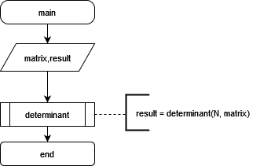
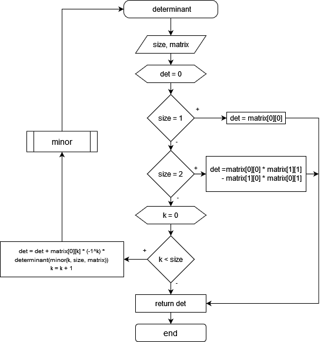
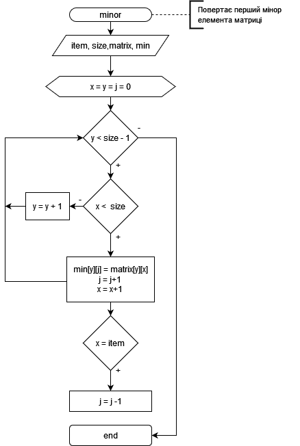

# Лаборатора робота №8. Тема: Основи документування.

## ВИМОГИ

**Розробник**: Куліков Владислав

**Завдання**: реалізувати функцію, що рахує детермінант матриці.

## Опис програми:
Програма знаходить детермінант необмежено великої матриці використовуючи рекурсію.

### Призначення та опис структури розроблених методів констант та змінних:

**Макровизначення**:

`#define SIZE 3` Розмірність матриці


**Опис функцій** :

`int main ()`
Точка входу в програму. Демонстрація рішення. Повертає: код помилки (0)




`int determinant(int size, int matrix[][size]`
Повертає значення детермінанту матриці


**Аргументи:**

* size - розмірність матриці
* matrix - вхідна матриця



`void minor(int item, int size, int matrix[][size], int min[][size-1])`
Повертає мінор матриці за елементом


**Аргументи:**

* item - порядок мінору (k)
* size - розмірність вхідної матриці
* matriх - вхідна матриця
* min - матриця, що міститиме мінор



### Структура програми

```
lab08
├── doc
│   ├── assets
│   │   ├── bsa.drawio
│   │   ├── function-main.png
│   │   ├── function-determinant.png
│   │   └── function-minor.png
│   ├── lab08.docx
│   ├── lab08.pdf
│   └── lab08.md
├── Doxyfile
├── Makefile
├── README.md
├── src
│   └── main.c
└── dist
      └── lab08.html

```

## Варіанти використання

* Матриця мусить бути квадратною

* Константа `N` має співпадати з розміром матриці

* Результат виконання програми можно побачити у відладнику, зупинившись на `return 0` функції main. Приклад виводу данних:

```
int matrix[N][N] = {{1, 2, 9},
                    {4, 5, 6},
                    {7, 8, 9}}; 

(int) result = -18
```

## ВИСНОВКИ.
Було покращено розуміння методу рекурсії. Були отримані навички створеня схем алгоритмів та документації до коду.